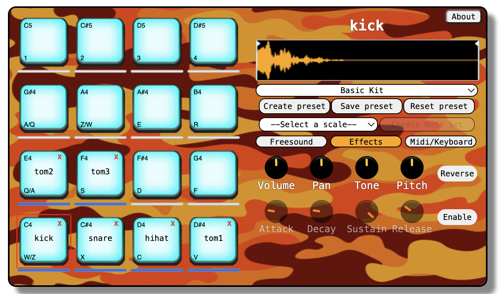
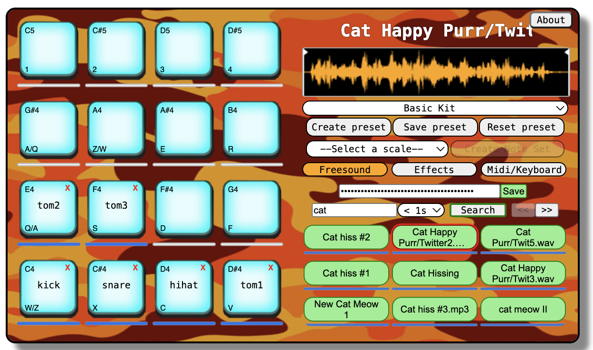

# Wam-Sampler

A Web Audio Module Sampler written in vanilla JavaScript and Web Components.

A live demo is available here : https://quentinplet.github.io/Wam-Sampler/

## Description

A Virtual Musical Instrument writing in JavaScript and running in a browser. You can trigger sounds (drum samples, piano notes...) by clicking on the pads or press the corresponding keyboard key. Each pad can be switched with others by drag and drop.

You can rename any samples by double-clicking on its name above the waveform.

It supports MIDI keyboards and the MIDI routing can be configured manually by right-clicking on a pad.
You can manually save your current configuration (samples pads location, effects and MIDI bindings) into a preset in the local storage. By default, several factory presets are available in the preset list.

## Usage

WAM-Sampler is part of the WAM (Web Audio Modules) instruments and effects community : https://github.com/webaudiomodules

It aims to be used in musical online environments or playgrounds that accepts the WAMs configuration, like [SequencerParty](https://sequencer.party/) or [Wam-studio](https://github.com/Brotherta/wam-studio).

### Freesound explorer

You can search for any samples you want using the search bar within the Freesound tab. In order to use the Freesound explorer you will need a Freesound API key. You can get a free API key here : https://freesound.org/help/developers/. After entering the API key, click on the save button to register your key in your local storage.

> :warning: **You will be limited to 60 requests per minute and 2000 requests per day**, more info here : https://freesound.org/docs/api/overview.html

You can select and play any samples by clicking on explorer green buttons. To add the selected sample into the sampler, just drag on drop the sample you want onto any sampler pad.

### Keyboard

To enable keyboard keys, click on the MIDI/Keyboard tab, then on the "Keyboard" button.

### MIDI routing

Currently only works with Chrome or Mozilla.
Select your MIDI input device from the list. A MIDI binding is already set by default, with the first pad routed to the C4 MIDI note. You can right-click on a pad to see an options menu. To configure a new binding, click on the "Learn" option, then press the MIDI key you want to assign to the pad.

The [webaudio-controls](https://github.com/g200kg/webaudio-controls) library is used for MIDI routing.

### Create a scale

By clicking on a pad, you can select the scale you want and click on 'Create Note Set.' Then, enter a preset name in the new input field to create a new preset. A brand new list of pad samples will be automatically configured with the notes of the scale and corresponding MIDI bindings.

### Effects

Each effect is independent of the others and affects only the currently selected sample.
On the waveform, you can select the start and end points of the sample by moving the right or left cursor.

## Run Locally

The easiest solution is to use [serve](https://www.npmjs.com/package/serve), a web server developed in the Node.js environment.

1. If not already, install Node and NPM
2. Clone the git repository
3. Navigate to the directory
4. Install serve `npm install serve`
5. Launch a local server using `npx serve`
6. The application will be accessible at the default address `http://localhost:3000`
